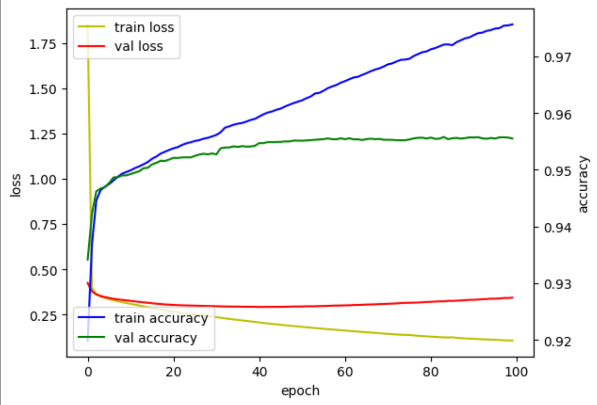
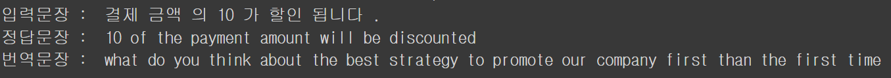

  LSTM Seq2Seq 모델을 이용해 영어를 한국어로 번역하는 모델을 만들어 보려고 한다. 가장 먼저 데이터를 구해야 하지만 [한국어-영어 병렬 말뭉치](http://www.manythings.org/anki)를 구하는 것이 매우 힘들었다. 구글링 하면서 어떻게 구하긴 했는데 데이터 수가 5892개로 생각보다 적었지만 일단 해보기로 했다.

#데이터 로드

데이터는 txt 파일로 되어있고 판다스 read_csv()를 이용해 로드했다. 

#데이터 전처리

전처리는 영어 소문자화, 그리고 문자와 구두점만 남겨놓고 모두 제거하는 과정을 거친 후 문장의 시작과 끝을 알리는 \<sos\>, \<eos\> 태그를 달아준다.

#데이터 토큰화

한국어 데이터는 konlpy의 Okt(), 영어 데이터는 tensorflow의 Tokenizer()를 이용해 토큰화 했다.

#데이터 섞기

데이터의 문장은 짧은 문장으로 시작해 뒤로 갈수록 문장이 길어져서 데이터를 섞어준다.

#데이터 분할

데이터는 훈련 : 검증 : 테스트 = 7 : 2 : 1로 분할한다.(비율은 최적화를 위해 바뀔수 있음)

#모델 훈련

데이터를 훈련하기 위한 모델의 코드이고 이를 그림으로 전체적인 구조를 그려보면 다음과 같다.

======그림=====

여기서 조절이 가능한 하이퍼파라미터의 목록은 다음과 같다.

* 데이터 분할 비율

* 임베딩 벡터의 차원(embedding_dim)
* LSTM 셀의 은닉층의 차원(hidden_units)
* 배치 크기(batch_size)
* 훈련 에폭(epochs)

첫번째 훈련 : (임베딩, 은닉층, 배치, 에폭) = (100, 256, 32, 300), 7 : 2 : 1

훈련데이터 정확도와 오차는 좋게 나왔지만 검증데이터의 오차는 매우 높게 나왔다. 즉 오버피팅이 일어났다.

번역 문장을 생성한 결과 중 일부는 다음과 같았다.

어느정도 문장은 만들어 냈지만, 조금도 비슷하지 않은 문장을 만들어냈다 ..

오버피팅은 보통 복잡도가 높아서 일어나니 차원을 조금 줄여보자.

두번째 훈련 : (임베딩, 은닉층, 배치, 에폭) = (100, 100, 32, 100), 7 : 2 : 1

이번에도 검증데이터 오차가 크게 줄어들지 않았다. 예측 결과도 역시 엉망이었다.

이번에는 하이퍼파라미터 조정과 함께 earlystopping 함수를 추가해서 학습을 시켜봤다. 조기종료 지표는 val_loss, patience = 10, min_delta = 1e-4로 설정했다.

세번째 훈련 : (임베딩, 은닉층, 배치, 에폭) = (64, 64, 64, 100), 7 : 2 : 1

지표상으로는 아까보다 나아졌지만 예측 결과를 보면 I'm not a very good person이라는 문장만 계속해서 출력하고 있다.

(2024/04/05)

하이퍼파라미터를 순차적으로 조정을 해봤지만 번역 결과가 계속해서 같은 몇개의 문장만 반복되는 모습을 보였다. 데이터를 좀더 찾아보다가 [한국어-영어 번역 말뭉치](https://aihub.or.kr/aihubdata/data/view.do?currMenu=115&topMenu=100&aihubDataSe=realm&dataSetSn=126) 데이터를 발견해서 이 데이터로 다시 해보기로 했다. 데이터는 총 10개의 파일이 있었고 전부 10만개 이상의 데이터들로 구성되어져 있었다. 

이 중에서 대화체 데이터를 이용해 다시 학습을 시켰다.

역시 트랜스포머 이후로 자연어 처리가 살아난걸 생각하면 LSTM seq2seq은 역부족인듯하다. 트랜스포머 기반 사전훈련 모델로 파인튜닝을 해봐야겠다.

