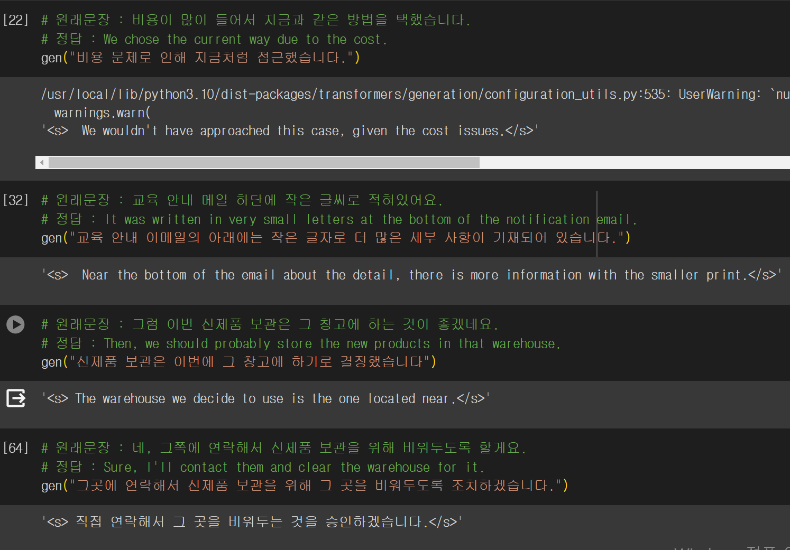

 저번에 LSTM셀로 이루어진 seq2seq모델로 번역기를 만들려고 했지만 실패했다. 이번에는 Llama2를 이용해 번역기를 만들어보자. 우선 저번에 사용했던 [한국어-영어 번역 말뭉치](https://aihub.or.kr/aihubdata/data/view.do?currMenu=115&topMenu=100&aihubDataSe=realm&dataSetSn=126)를 사용한다.

# 데이터 정제

데이터를 Llama2에 파인튜닝하기 적합한 형태로 만들어주기 위해 .json파일로 [정제작업](https://github.com/swyoo5/LlamaFineTuning/blob/main/2_%EB%8C%80%ED%99%94%EC%B2%B4_%EB%8D%B0%EC%9D%B4%ED%84%B0_%EC%A0%95%EC%A0%9C.ipynb)을한다. 정제작업이 끝난 json파일의 앞 3줄만 가져와보면 다음과 같다.

```python
# "text" : 프롬프트 ### 한국어 ### 영어
[
{"text": "Korean and English sentences are given in order below. Translate Korean sentences into English sentences. ### Korean : 이번 신제품 출시에 대한 시장의 반응은 어떤가요? ### English : How is the market's reaction to the newly released product?"},
{"text": "Korean and English sentences are given in order below. Translate Korean sentences into English sentences. ### Korean : 판매량이 지난번 제품보다 빠르게 늘고 있습니다. ### English : The sales increase is faster than the previous product."},
{"text": "Korean and English sentences are given in order below. Translate Korean sentences into English sentences. ### Korean : 그렇다면 공장에 연락해서 주문량을 더 늘려야겠네요. ### English : Then, we'll have to call the manufacturer and increase the volume of orders."}
] 
```

 수행하고자 하는 작업에 대한 프롬프트, 한국어, 영어 순으로 이루어진 딕셔너리들로 이루어진 리스트로 만들었다.

# 파인튜닝

파인튜닝은 huggingFace의 auto train 모듈을 사용했고 모델은 TinyPixel/Llama-2-7B-bf16-sharded을 사용했다. 전체 코드는 [깃허브](https://github.com/swyoo5/LlamaFineTuning/blob/main/2_%EB%8C%80%ED%99%94%EC%B2%B4_%EB%8D%B0%EC%9D%B4%ED%84%B0_Fine_Tuning.ipynb)에 올려놓았다.


# 번역 결과

## 결과1




영어로 어느정도 잘 번역된 문장도 있고 매끄럽지 못한 문장도 있었다.  에폭수를 늘리고 다시 학습을 시켰지만 여전히 한국어로 출력되는 문제는 발생했다.


