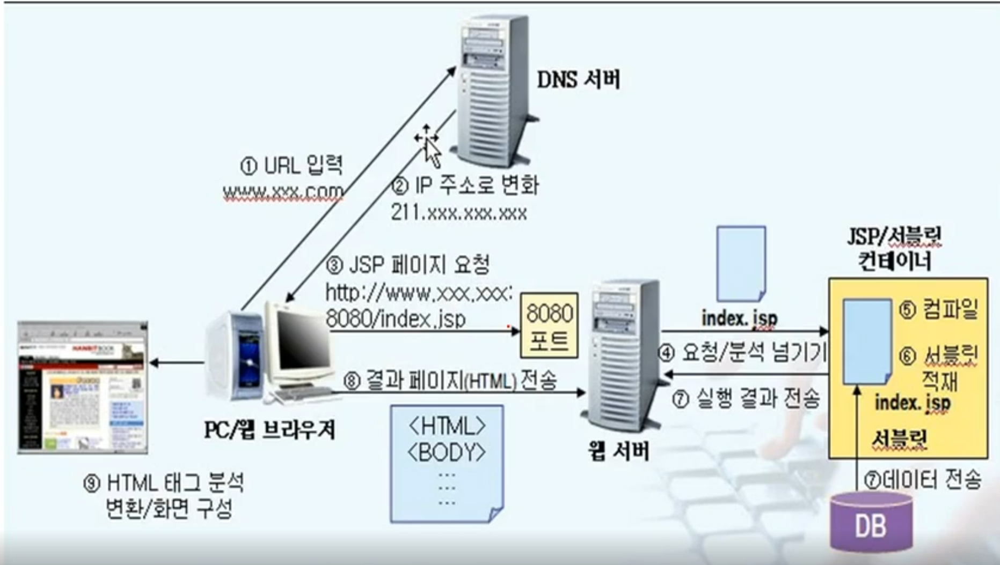

[JSP 웹 쇼핑몰 프로그래밍 기본 과정](https://www.inflearn.com/course/jsp-%EC%9B%B9%EA%B0%9C%EB%B0%9C-%EC%87%BC%ED%95%91%EB%AA%B0-%ED%94%84%EB%A1%9C%EA%B7%B8%EB%9E%98%EB%B0%8D/dashboard)

해당 강의를 수강하며 정리한 글입니다.

# JSP 처리과정

jsp의 처리과정은 다음과 같다.

1. URL 입력 :

   클라이언트(사용자 브라우저)에서 URL을 입력받는다

   예를 들어 네이버(www.naver.com)과 같은 도메인주소를 입력받는다.

2. IP 주소 변환

   입력받은 URL을 기반으로 DNS 서버에 요청을 보내고 DNS 서버는 해당 URL에 대응하는 IP주소를 반환한다.

3. JSP 페이지 요청

   브라우저는 IP주소를 이용해 웹서버에 연결하고 요청된 JSP 페이지의 URL을 웹서버에 전달한다. 이때 포트번호 8080은 톰캣의 포트번호를 의미한다. 이때 강의에서 비유하기로 포트번호는 아파트의 주소가 아닌 아파트의 동, 호수에 비유할 수 있다고 말씀하셨다.

4. 웹 서버에서 JSP 요청 분석

   웹 서버는 브라우저로부터 전달받은 JSP 파일 요청을 확인하고 이 요청을 JSP/서블릿 컨테이너로 넘긴다. 서블릿 컨테이너는 JSP를 처리하는 역할을 하며, DB로부터 데이터를 전송받은 뒤 JSP파일 -> 서블릿파일 -> 클래스 파일 순서로 컴파일을 한다. 그 후 버퍼에 저장

5. 실행 결과 전송

   버퍼에 저장된 클래스 파일을 웹 서버로 전송한다.

6. 결과페이지 전송

   전달받은 클래스 파일을 사용자 PC/브라우저로 전송하면 사용자 PC의 JVM이 해당 클래스 파일을 해석하여 화면에 나타나게 한다.

세션 : 장바구니, DB에 저장하지 않고도 페이지를 이동할 때도 정보를 저장하고 싶을때 사용하는 내장객체. 세션을 계속 유지시키면 리소스가 많이 듬 => 일정시간 지나면 세션을 끊는다.

버퍼 : 동영상 일정 용량을 버퍼에 저장 => 네트워크가 불안정해도 버퍼에 담긴 정보는 계속해서 나옴.

autoflush : 버퍼에 용량이 가득차지 않아도 정보를 내보냄(false로 지정하면 hello world를 찍어도 출력되지 않음(버퍼가 가득차지 않았기 때문에))