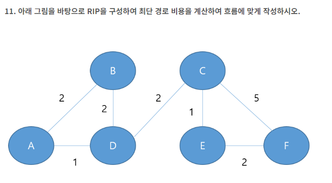

# 2024-2회

## 5. 프로토콜

**다음은 프로토콜에 대한 내용이다. 아래 내용을 읽고 알맞는 답을 작성하시오.**

\- Network layer에서 IP패킷을 암호화하고 인증하는 등의 보안을 위한 표준이다. 

\- 기업에서 사설 인터넷망으로 사용할 수 있는 VPN을 구현하는데 사용되는 프로토콜이다.
\- AH(Authentication Header)와 ESP(Encapsulating Security Payload)라는 두 가지 보안 프로토콜을 사용한다.

정답 : IPSec


## 8. 패킷 교환 방식

 **패킷 교환 방식 중에 연결형과 비연결형에 해당하는 방식을 작성하시오.** 

① 연결형 교환 방식

정답 : 가상회선

② 비연결형 교환 방식

정답 : 데이터그램


## 9. 모듈

실행 순서가 밀접한 관계를 갖는 기능을 모아 모듈로 구성한다.
한 모듈 내부의 한 기능 요소에 의한 출력 자료가 다음 기능 원소의 입력 자료로서 제공되는 형태이다.

**보기**

ㄱ. 기능적(functional)      ㄴ. 우연적(Coincidental)      ㄷ. 통신적(Communication)    ㄹ. 절차적(Procedural)     ㅁ. 시간적(Temporal)      ㅂ. 순차적(sequential)       ㅅ.  논리적(Logical)

정답 : ㅂ(순차적)


## 10. 디자인패턴

**10. 아래는 디자인 패턴에 관한 설명이다. 아래 설명을 읽고 보기에서 알맞는 용어를 작성하시오.**


\- 컬렉션 객체의 내부 구조를 노출하지 않고 순차적으로 접근할 수 있게 하는 패턴이다. 
\- 이 패턴은 객체의 내부 표현 방식에 독립적으로 요소에 접근할 수 있도록 해준다
\- 반복 프로세스를 캡슐화하여 클라이언트 코드에서는 컬렉션의 구체적인 구현에 종속되지 않도록 한다.

**보기**

| 생성패턴         | 구조패턴  | 행위패턴 |
| ---------------- | --------- | -------- |
| Singleton        | Adapter   | Iterator |
| Factory Method   | Bridge    | Visitor  |
| Abstract Factory | Composite | Observer |

정답 : Abstract Factory


## 11. RIP(Routing Information Protocol) 라우팅 최단경로



A => D => C => F

해설 : C => E => F로 가지 않는 이유는 홉(노드) 수에 기반하여 최단 경로를 선택한다.


## 12. SRT 스케줄링 평균 대기시간

**아래의 표를 확인하여 SRT 스케줄링의 평균 대기시간을 계산하여 작성하시오.**

 

| 프로세스 | 도착 시간 | 서비스 시간 |
| -------- | --------- | ----------- |
| A        | 0         | 8           |
| B        | 1         | 4           |
| C        | 2         | 9           |
| D        | 3         | 5           |


## 13. C

```c
#include <stdio.h>
 
int main() {
    int arr[3][3] = {1, 2, 3, 4, 5, 6, 7, 8, 9};
    int* parr[2] = {arr[1], arr[2]};
    printf("%d", parr[1][1] + *(parr[1]+2) + **parr);
    
    return 0;
}
```

해설 : 

parr[2] =  {{4, 5, 6}, {7, 8, 9}}

parr\[1\]\[1\] = 8

*(parr[1] + 2) = 9

**parr = 4

정답 : 21


1. 25, 20 o
2. 10 o
3. control o
4. 
5. 2
6. 20 o
7. E

