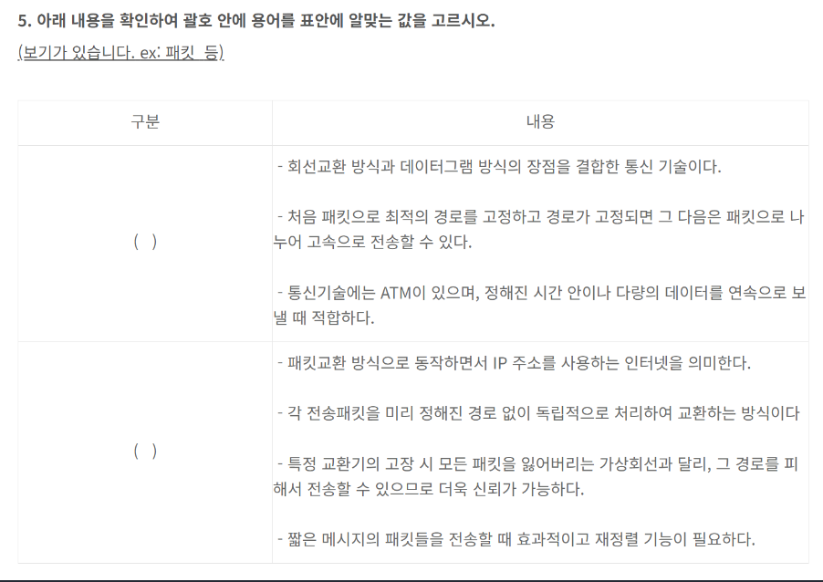

 정처기 기출 복원을 잘 해둔 블로그가 있어서 그 블로그의 문제를 보면서 정리했다. 정리했던 글들의 링크이다.

[참고 블로그](https://chobopark.tistory.com/483#google_vignette)

[정처기 22년 1회](https://swyoo5.github.io/programming/%EC%9E%90%EA%B2%A9%EC%A6%9D/22%EB%85%841%ED%9A%8C/)

[정처기 22년 2회](https://swyoo5.github.io/programming/%EC%9E%90%EA%B2%A9%EC%A6%9D/22%EB%85%842%ED%9A%8C/)

[정처기 22년 3회](https://swyoo5.github.io/programming/%EC%9E%90%EA%B2%A9%EC%A6%9D/22%EB%85%843%ED%9A%8C/)

[정처기 23년 1회](https://swyoo5.github.io/programming/%EC%9E%90%EA%B2%A9%EC%A6%9D/23%EB%85%841%ED%9A%8C/)

[정처기 23년 2회](https://swyoo5.github.io/programming/%EC%9E%90%EA%B2%A9%EC%A6%9D/23%EB%85%842%ED%9A%8C/)

[정처기 23년 3회](https://swyoo5.github.io/programming/%EC%9E%90%EA%B2%A9%EC%A6%9D/23%EB%85%843%ED%9A%8C/)

[정처기 24년 1회](https://swyoo5.github.io/programming/%EC%9E%90%EA%B2%A9%EC%A6%9D/24%EB%85%841%ED%9A%8C/)

[정처기 24년 2회](https://swyoo5.github.io/programming/%EC%9E%90%EA%B2%A9%EC%A6%9D/24%EB%85%842%ED%9A%8C/)

# 정리

## UI 설계 원칙

1. 직관성 : 누구나 쉽게 이해, 사용
2. 학습성 : 누구나 쉽게 학습
3. 유연성 : 사용자 요구사항 최대한 수용, 오류 최소화
4. 유효성 : 사용 목적 정확하게 달성

## SRT 스케줄링 평균 대기시간

**아래의 표를 확인하여 SRT 스케줄링의 평균 대기시간을 계산하여 작성하시오.**

| 프로세스 | 도착 시간 | 서비스 시간 |
| :------- | :-------- | :---------- |
| P1       | 0         | 8           |
| P2       | 1         | 4           |
| P3       | 2         | 9           |
| P4       | 3         | 5           |

SRT 알고리즘 : SJF 선점형 방식, 최단 남은 시간 계산

프로세스 실행 : 1, 2, 2, 2, 2, 4, 4, 4, 4, 4, 1, 1, 1, 1, 1, 1, 1, 9, 9, 9, 9, 9, 9, 9, 9, 9

대기시간

P1 : 10 - 1 = 9 P3 : 17 - 2 = 15

P2 : 1 - 1 = 0 P4 : 5 - 3 = 2

(9 + 15 + 0 + 2) / 5 = 6.5초

## 페이지 부재 횟수 계산문제

**다음은 운영체제 페이지 순서를 참고하여 할당된 프레임의 수가 3개일 때 LRU와 LFU 알고리즘의 페이지 부재 횟수를 작성하시오.**

페이지 참조 순서 : 1, 2, 3, 1, 2, 4, 1, 2, 5, 7

(1) LRU : 6 (2) LFU : 6

## IP 주소 계산

* IP 주소가 139.127.19.132이고 서브넷마스크 255.255.255.192일 때 아래의 답을 작성하시오. (10진수로 표기)

(1) 괄호안에 들어갈 네트워크 주소 : 139.127.19.( )

서브넷 마스크 => 11111111.11111111.11111111.11000000

마지막 8비트 => 이진수로 11000000

마지막 바이트는 호스트 비트 6개 => 2^6 = 64개의 호스트를 구분할 수 있다.

0~63 : 네트워크 주소는 0

64~127 : 네트워크 주소는 64

128~191 : 네트워크 주소는 128

192~255 : 네트워크 주소는 192

정답 : 128

(2) 해당 네트워크 주소와 브로드캐스트 주소를 제외한 호스트 개수

총 32비트 중 네트워크 부분의 비트는 26비트, 호스트 부분의 비트는 6비트이다.

호스트 개수는 2^6=64개이지만, 첫번째 주소(139.127.19.128)는 네트워크 주소, 마지막 주소(139.127.19.191)는 브로드캐스트 주소로 사용 => 64 - 2 = 62

* 첫번째 네트워크 주소가 192.168.1.0/26일때 FLSM 3개로 분할했을때 두번째 네트워크 브로드캐스드 IP를 10진수로 변환한 값을 작성하시오.

  풀이) 끝에 26은 26비트를 의미함. 총 32비트 중 6비트는 호스트를 위한 비트이다. 2^6개 단위루 분할하면

  - 첫번째 서브넷 : (앞자리 생략) 0 ~ 63
  - 두번째 서브넷 : 64 ~ 127
  - 세번째 서브넷 : 128 ~ 191

  브로드캐스트 IP는 서브넷에서 마지막 주소를 의미한다(참고로 첫번째 주소는 네트워크 주소를 의미). 정답은 ~~~.127이다.

* 아래 그림에서의 네트워크에서 라우터을 통한 할당 가능한 **2번, 4번, 5번의** IP를 작성하시오.

1) 192.168.35.3/24
2) 129.200.10.16/22
3) 192.168.36.24/24

**보기**

192.168.35.0

192.168.35.72

192.168.36.0

192.168.36.249

129.200.8.0

129.200.8.249

**정답**

2) 192.168.35.72
3) 129.200.8.249
4) 192.168.36.249

**해설**

1) 192.168.35.3/24

서브넷 마스크 : 255.255.255.0

서브넷 범위 : 192.168.35.0 ~ 192.168.35.255(2^6 = 256개)

할당 가능 IP : 192.168.35.1 ~ 192.168.35.254

3) 129.200.10.16/22

서브넷 마스크 : 255.255.252.0

서브넷 범위 : 129.200.8.0 ~ 129.200.11.255(2^10 = 1024개 = 256 * 4)

할당 가능 IP : 129.200.8.1 ~ 129.200.11.254

6) 192.168.36.24/24

서브넷 마스크 : 255.255.255.0

서브넷 범위 : 192.168.36.0 ~ 192.168.36.255

할당 가능 IP : 192.168.36.1 ~ 192.168.36.254

## 목적에 따른 디자인 패턴

* 생성 패턴

|       이름       |                             설명                             |
| :--------------: | :----------------------------------------------------------: |
| Abstract Factory | 구체적인 클래스에 의존x 서로 연관되거나 의존적인 객체들이 조합된 인터페이스 제공 |
|     Builder      | 객체 생성 단계를 캠슐화/분리하여 객체를 조립하여 생성 동일한 객체 생성 절차에서 서로 다른 표현 결과 제공 |
|  Factory Method  | 상위 클래스에서 객체 생성 인터페이스를 정의하지만, 인스턴스를 만드는 클래스는 서브 클래스에서 결정하도록 분리 |
|    Prototype     |         원본/원형 객체를 복제하는 방식으로 객체 생성         |
|    Singleton     | 클래스에서 하나의 객체만 생성 가능하며 해당 객체를 어디서든 참조할 수 있지만 여러 프로세스가 동시에 참조는 불가 |

* 구조 패턴

|   이름    |                             설명                             |
| :-------: | :----------------------------------------------------------: |
|  Adaptor  |          비호환 인터페이스에 호환성 부여하도록 변환          |
|  Bridge   |  구현부에서 추상층을 분리 후 각자 독립적으로 변형/확장 가능  |
| Composite | 트리 구조로 부분/전체 계층 표현, 복합/단일 객체를 구분없이 사용 |
| Decorator | 상속 사용없이 객체 간 결합을 통해 객체 기능을 동적으로 추가/확장 |
|  Facade   | 상위에 인터페이스 구성하여 서브클래스의 기능을 복잡하게 표현하지 않고 단순한 인터페이스로 구현 |
| Flyweight |        인스턴스를 공유하여 메모리 절약(클래스 경량화)        |
|   Proxy   |  접근이 힘든 객체를 연결하는 인터페이스 역할(대리객체수행)   |

* 행위 패턴

|          이름           |                             설명                             |
| :---------------------: | :----------------------------------------------------------: |
| Chain of Responsibility | 처리가능한 객체가 둘 이상 존재하여 한 객체 내 처리 불가 시 다음 객체러 이관 |
|         Command         |   요청 명령어들을 추상/구체 클래스로 분리 후 단순화/캡슐화   |
|       Interpreter       |                    언어에 문법 표현 정의                     |
|        Iterator         |        접근이 빈번한 객체에 대해 동일 인터페이스 사용        |
|        Mediator         |  객체들 간 복잡한 상호작용을 캡슐화하여 객체로 정의 후 중재  |
|         Memento         | 객체를 이전의 특정 시점의 상태로 저장하고 복원(캡슐화 유지)  |
|        Observer         |    한 객체 상태 변화 시 상속되어 있는 객체들에 변화 전달     |
|          State          |         객체의 상태에 따라 동일한 동작을 다르게 처리         |
|        Strategy         |     동일 계열 알고리즘을 개별적으로 캡슐화하여 상호 교환     |
|     Template Method     | 여러 클래스에서 공통 사용 메서드를 상위 클래스에서 정의하고 하위 클래스마다 다르게 구현해야 하는 세부 사항을 개별 구현 |
|         Visitor         | 각 클래스 데이터 구조로부터 처리/연산 기능을 분리하여 별도의 클래스를 만들고, 해당 클래스 메서드가 각 클래스를 돌아다니며 특정 작업을 수행 => 객체 구조 변경x / 새로운 연산 기능만 추가 |

## 테스트 오라클

참 오라클(True) : 모든 입력값에 대해 기대하는 결과 생성하여 오류 검출

샘플링 오라클(Sampling) : 특정한 몇개의 입력값에 대해 기대하는 결과 제공

휴리스틱 오라클(heuristic) : 샘플링 오라클 개선/특정 입력값에 올바른 결과를 제공하고 나머지 값은 휴리스틱으로 처리

일관성 검사 오라클 : Application 변경 있을 때 수행 전과 후의 결과값이 동일한지 확인

## 접근 통제 방법

임의적 접근 통제(Discretionary Access Control) : 시스템 객체에 대한 접근을 **사용자나 그룹의 신분을 기준으로 제한**

강제적 접근 통제(Mandatory Access Control) : **미리 정해진 정책, 보안 등급**에 의거하여 주체에게 허용된 접근 권한과 객체에서 부여된 허용 등급을 비교하여 접근을 통제

역할 기반 통제(Role Based Access Control) : DAC, MAC 단점 보완/멀티 프로그래밍 환경에서의 보안 처리를 위해 제안, 사용자에게 할당된 **역할에 기반**하여 접근을 통제하며 중앙에서 집중적으로 관리

## 패킷 교환 방식

* 목적지 호스트와 미리 연결, 통신하는 연결형 교환방식 : 가상회선방식
* 헤더에 붙어서 개별적으로 전달하는 비연결형 교환방식 : 데이터그램

**정답 : 가상회선, 데이터그램**

## 테스트 하네스

상향식 : 드라이브

하향식 : 스텁

테스트 슈트 : 시스템에 사용되는 테스트 케이스의 집합

테스트케이스 : 사용자의 요구사항 준수 여부 확인 위해 설계된 테스트 항목 명세서

테스트 스크립트 : 자동화된 테스트 실행 절차에 대한 명세서

목 오브젝트 : 사용자의 행위 조건부 입력 시 계획된 행위를 수행하는 객체

## RAID

RAID : 여러 독립적인 디스크를 하나의 논리적 장치처람 묶어 성능 향상, 데이터 안정성 높임.

0단계 : 하나의 디스크라도 고장나면 모든 데이터를 잃을 수 있다.

1 : 데이터를 복제하여 **동일한 데이터를 두개 이상의 디스크에 저장**하는 방식. 하나의 디스크가 고장나더라도 다른 디스크에서 데이터를 복구할 수 있다. 장점은 안정성이 뛰어나지만 단점은 디스크 공간의 절반만 사용할 수 있다.

2 : 데이터 오류를 검출하고 복구할 수 있도록 **해밍 코드**를 사용하는 방식. 비트 단위로 데이터를 나누어 여러 디스크에 분산 저장하고, 패리티와 해밍 코드를 사용해 오류를 교정. 단점은 매우 복잡하고 구현이 어렵다.

3, 4 : 데이터를 스트라이핑하여 **여러 디스크에 분산 저장**, 패리티 정보를 **하나의 디스크**에 저장.

3은 **비트단위**로 저장, 4는 **블록 단위**로 저장. 장점은 성능이 향상, 패리티 => 한 디스크 고장나도 데이터를 복구할 수 있다. 단점은 패리티 디스크가 병목현상 일으킬 수 있다.

5 : 패리티 정보를 **각 디스크에 분산저장** . RAID 4의 단점 개선. 데이터를 블록 단위로 나누어 저장. 패리티 정보를 분산시켜 병목현상 줄임. 읽기와 쓰기 성능 균형이 우수, 하나 고장나도 복구 가능. 패리티 계산으로 쓰기 성능 저하

6 : RAID 5와 유사하지만 **parity 다중화, 여러 디스크 내에 분산저장**. 두개가 고장나도 데이터 복구. 매우 높은 안정성, 패리티 계산 복잡

10 : RAID1과 0을 조합 => 빠른 성능, 높은 안전성, 비용 높음

## 암호화 알고리즘

1. Xuejia Lai와 James Messey 가 만든 알고리즘으로 PES(Proposed Encryption Standard)에서 IPES(Improved PES)로 변경되었다가, 1991년에 제작된 블록 암호 알고리즘으로 현재 국제 데이터 암호화 알고리즘으로 사용되고 있다. 64비트 블록을 128비트의 key를 이용하여 8개의 라운드로 구성되어 있다.

   IDEA

2. 미국의 NSA에서 개발한 Clipper 칩에 내장되는 블록 알고리즘이다. 전화기와 같은 음성을 암호화 하는데 주로 사용되며 64비트 입출력에 80비트의 키 총 32라운드를 가진다.

   SKIPJACK

대칭 : DES, AES, ARIA, SEED

비대칭 : RSA, ECC

## 자료 전송

- ( )은/는 자료를 **일정한 크기로 정하여** 순서대로 전송하는 자료의 전송 방식이다.
- 셀이라 부르는 고정 길이 패킷을 이용하여 처리가 단순하고 고속망에 적합하며, 연속적으로 셀을 보낼 때 **다중화를 하지 않고** 셀단위로 동기가 이루어지지만 경우에 따라 동기식 시간 분할 다중화를 사용하기도 한다.
- 가상 채널 (Virtual Channel) 기반의 연결 지향 서비스로 셀이라 부르는 **고정 길이(53바이트) 패킷**을 사용하며 통계적 다중화 방식을 이용한다.

**ATM**(Asynchronous Transfer Mode)

## 네트워크

IP 패킷에서 외부의 공인 IP주소와 포트 주소에 해당하는 **내부 IP주소**를 재기록하여 **라우터를 통해 네트워크 트래픽을 주고받는 기술**은 무엇인가?

**NAT**(Network Address Transformation)

## 테스트 커버리지

1. 구문 커버리지

   모든 명령문 **적어도 한번** 수행

2. 결정 커버리지

   결정 포인트 내의 **전체 조건식**이 **적어도 한번은 참과 거짓**의 결과를 수행

3. 조건 커버리지

   결정 포인트 내의 각 **개별 조건식**이 **적어도 한번은 참과 거짓**의 결과를 수행

4. 조건/결정 커버리지

   **전체 조건식**뿐만 아니라 **개별 조건식**도 **참과 거짓**의 결과를 수행

5. 변형 조건/결정 커버리지

   **개별 조건식**이 다른 개별 조건식에 영향을 받지 않고 **전체 조건식에 독립적으로 영향**을 주도록 향상시킨 커버리지

6. 다중 조건 커버리지

   모든 개별 조건식의 모든 **가능한 조합을 100% 보장**하는 커버리지

7. 기본 경로 커버리지

   수행 가능한 **모든 경로를 테스트**하는 커버리지

8. 제어 흐름 커버리지

   프로그램 **제어 구조**를 **그래프 형태**로 나타내어 내부 로직 테스트

9. 데이터 흐름 커버리지

   **제어 흐름** 그래프에 **데이터 사용현황**을 추가한 그래프 테스트

## 목적에 따른 테스트 기법

- 테스트 목적에 따른 분류

  회복(recovery) : 시스템에 **고의로 실패를 유도**하고, 시스템의 정상적 **복귀 여부**를 테스트

  안전(security) : 소스 내 **보안적인 결함**을 **미리 점검**하는 테스트

  성능(performance) : **응답 시간, 반응 속도, 처리량** 등을 측정하는 테스트

  구조(structure) : 시스템의 **내부 논리 경로, 소스 코드의 복잡도** 테스트

  회귀(regression) : 오류제거와 수정에 의해 **새로 유입된 오류**가 없는지 확인하는 일종의 **반복** 테스트

  병행(parellel) : 변경된 시스템과 기존 시스템에 **동일한 데이터 입력 후 결과 비교**

## 선점 & 비선점

- 선점 스케줄링

  우선순위가 높은 프로세스 빠르게 처리

  많은 오버헤드

  우선순위가 높은 다른 CPU를 뺏을 수 있다.

  선점이 가능하도록 일정 시간 배당에 대한 인터럽트용 타이머 클록이 필요하다.

| RR(Round Robin)                  | FCFS를 선점 형태로 변형한 기법 프로세스는 할당된 시간 동안 실행한 후 실행이 완료되지 않으면 다음 프로세스에 CPU를 넘겨주고 큐의 뒤로 배치 |
| :------------------------------- | :----------------------------------------------------------- |
| SRT(Shortest Remaining Time)     | SJF 알고리즘을 선점 형태로 변형한 기법 실행중인 프로세스의 남은 시간과 준비상태 큐에 도착한 프로세스의 실행 시간 비교 가장 짧은 실행 시간을 요구하는 프로세스에 CPU 할당 |
| MLQ(Multi Level Queue)           | 프로세스를 특정 그룹으로 분류할 수 있을 경우 그룹에 따라 각기 다른 준비상태 큐를 사용 |
| MLFQ(Multi Level Feedback Queue) | 특정 그룹의 준비상태 큐에 들어간 프로세스가 다른 준비상태 큐로 이동할 수 없는 다단계큐 기법을 이동할 수 있도록 개선한 기법 |

- 비선점 스케줄링

  프로세스 응답시간 예측이 용이, 일괄 처리 방식에 적합

  중요한 작업이 기다리는 경우가 생긴다.

  | FCFS(First Come First Service)   | 준비상태 큐에 도착한 순서에 따라 차례로 CPU 할당 공평성은 유지되지만 중요한 작업이 중요하지 않은 작업을 기다리는 경우 발생 |
  | :------------------------------- | :----------------------------------------------------------- |
  | SJF(Shortest Job First)          | 실행 시간이 짧은 프로세스에 먼저 CPU 할당 가장 적은 평균 대기시간을 제공함 |
  | HRN(Highest Response-ratio Next) | 실행 시간이 긴 프로세스에 불리한 SJF 기법을 보완하기 위한 기법 대기시간과 실행시간을 이용 우선순위 계산 결과값이 높은 것부터 우선순위 부여, 대기 시간이 긴 프로세스일 경우 계산 결과값이 높게 나온다. |

## 블랙박스 & 화이트박스

* 블랙박스

  * 동치분할 : 입력 조건에 타당한 입력자료, 타당하지 않은 입력자료 개수 균등하게 진행
  * 경계값 분석 : 입력 조건의 경계값을 테스트 케이스로 선정
  * 원인 효과 그래프 검사 : 입력 데이터 간의 관계와 출력에 미치는 상황을 체계적으로 분석 후 효용성이 높은 테스트 케이스 선정
  * 오류 예측 검사 : 과거의 경험, 확인자의 감각으로 진행
  * 비교 검사 : 여러 버전의 프로그램에 동일한 결과가 출력되는지 확인

* 화이트 박스

  * 검증 기준

    구문 커버리지 : 프로그램 내 모든 명령문을 적어도 한번 수행

    결정 커버리지 : 프로그램 내 전체 결정문이 적어도 한번은 참, 거짓 결과 수행

    조건 커버리지 : 결정 명령문 내의 각 개별 조건식이 적어도 한번은 참, 거짓 결과 수행

    조건/결정 커버리지 : 전체 조건식 & 개별 조건식이 참, 거짓 각각 한번 이상 결과 수행

  * 종류

    * 기초 경로 검사 : 대표적인 화이트박스 테스트 기법, 테스트 케이스 설계자가 절차적 설계의 논리적 복잡성을 측정할 수 있게 해주는 테스트 기법, 측정 결과는 실행 경로의 기초를 정의하는 지침으로 사용

    * 제어 구조 검사 
      * 조건 검사 : 프로그램 모듈 내의 논리적 조건 테스트
      * 루프 검사 : 프로그램 반복 구조 테스트
      * 자료 흐름 검사 : 변수의 정의와 변수 사용의 위치 테스트

## OSI 7 계층

통신이 일어나는 과정 7계층

1. 물리

   전기적, 기계적, 기능적인 특성 이용해 통신 케이블로 데이터 전송

   통신단위 : 비트

   전달만 할 뿐 데이터가 무엇인지, 에러가 있는지는 신경x

2. 데이터링크

   물리 계층을 통해 송수신되는 정보의 오류와 흐름을 관리하여 안전한 정보의 전달을 수행할 수 있도록 도와주는 역할

   단위 : 프레임

   CRC 기반의 오류 제어와 흐름 제어가 필요

3. 네트워크

   데이터를 목적지까지 가장 안전하고 빠르게 전달하는 기능

   경로를 선택, 주소 선택, 경로에 따라 패킷을 전달해주는 역할

   여러개의 노드를 거칠 때마다 경로를 찾아주는 역할

4. 전송

   통신을 활성화. TCP 프로토콜 이용, 포트를 열어 응용프로그램들이 전송할 수 있게 한다.

5. 세션

   데이터가 통신하기 위한 논리적인 연결(통신하기 위한 대문)

6. 표현

   데이터 표현이 상이한 응용 프로세스의 독립성을 제공, 암호화

   코드 간의 번역을 담당

   MIME 인코딩, 암호화 등이 이루어진다.

7. 응용

   응용 프로세스와 직접 관계하여 일반적인 응용 서비스를 수행한다.

## UML

### 클래스 사이의 관계

* 연관 관계 : 연결
* 일반화 관계 : 상속
* 집합 관계
  * 집약 : 전체-부분(독립적)
  * 합성 : 전체-부분(의존적)
  * 의존
  * 실체화 : 인터페이스 구현

## 프로토콜

대표적인 내부 라우팅 프로토콜, 다익스트라 알고리즘을 이용한 대규모 네트워크에 적합한 링크 상태 라우팅 프로토콜로 불리는 라우팅 프로토콜 : OSPF(Open Shortest Path First)

* 인터넷 계층 주요 프로토콜

  RARP : ARP와 반대로 물리적 주소를 IP 주소로 변환

  ARP : 호스트의 IP 주소를 물리적 주소(MAC address)로 변환

  IP : 전송할 데이터에 주소 지정, 경로 설정, 비연결형인 데이터그램 방식 사용, 신뢰성 보장 x

  ICMP : IP와 조합해 통신중에 발생하는 오류의 처리와 전송 경로 변경 등을 위한 제어 메시지를 관리하는 역할

  IGMP : 멀티 캐스트를 지원하는 호스트, 라우터 사이에서 멀티캐스트 그룹 유지를 위해 사용, 화상회의, IPTV에서 활용.

* 라우팅 프로토콜

  RIP : 현재 가장 널리 사용되는 라우팅 프로토콜로, 소규모 동종의 네트워크 내에서 효율적인 방법이며, 최대 홉수를 15로 제한함. 거리벡터 방식인 Bellman-Ford 알고리즘 사용. 자율 시스템(AS) 사용.
  IGRP : RIP의 단점을 보완하기 위해 만들어 개발된 것으로, 네트워크 상태를 고려하여 라우팅하며, 중규모 네트워크에 적합함
  OSPF : 대규모 네트워크에서 많이 사용되는 라우팅 프로토콜로, 라우팅 정보에 변화가 생길 경우 변화된 정보만 네트워크 내의 모든 라우터에 알리며, RIP에 비해 홉수에 제한이 없음. 자신을 기준으로 한 다익스트라 알고리즘 기반으로 최단 경로를 찾는 라우팅 (Link-State) 프로토콜
  BGP : 자율 시스템(AS) 간의 라우팅 프로토콜로, 도달 가능성 정보를 교환하도록 설계된 표준화된 외부 게이트웨이 프로토콜의 하나. 대형 사업자(ISP)

1. 라우터로 상호 접속이 되어있는 여러 개의 네트워크 집합으로 도메인 혹은 자율시스템(Autonomous System, AS)이라고 한다.

같은 도메인 내에 존재하는 라우터는 도메인 내부 라우터가 되고 도메인 외부에 존재하는 라우터는 도메인 외부 라우터가 되는데, 여기서 도메인 내부 경로 설정을 가르킨다.

**IGP**(Interior Gateway Protocol)

1. 시스템 사이에 경로 설정 정보 등을 교환하기 위해 사용하는 프로토콜로써,

다른 도메인 사이에 라우팅 시 정리된 관리가 거의 없고 많은 경우에 신용도가 매우 낮아 빠른 수행보다는 보안과 제어가 본래의 목적이다.

**EGP**(Exterior Gateway Protocol)

1. IP 라우팅 프로토콜의 한 종류로써 RIP(routing information protocol)보다 규모가 큰 네트워크에서도 사용할 수 있다.

규모가 크고 복잡한 TCP/IP 네트워크에서 RIP의 단점을 개선한 라우팅 프로토콜로써 RIP에 비해 자세한 제어가 가능하고, 관리 정보의 트래픽도 줄일 수 있다.

**OSPF**(Open Shortest Path First)

1. 서로 다른 자율 시스템(AS)의 라우터 간에 라우팅 정보를 교환하는 데 사용되는 외부 게이트웨이 프로토콜(EGP)이다.

각 목적지에 대한 전체 경로가 포함되며, 다른 시스템과 교환하는 네트워크 도달 가능성 정보의 데이터베이스를 유지한다. 네트워크 도달 가능성 정보를 사용하여 AS 연결 그래프를 구성하며, 이를 통해 라우팅 루프를 제거하고 AS 수준에서 정책 결정을 실행할 수 있다.

**BGP**(Border Gateway Protocol)

## 결합도 & 응집도

* 결합도
  * 내용(결합도 높음)
  * 공통
  * 외부
  * 제어
  * 스탬프
  * 자료(결합도 낮음)
* 응집도
  * 기능(응집도 높음)
  * 순차
  * 교환
  * 절차
  * 시간
  * 논리
  * 우연(응집도 낮음)

## 해킹 용어

다음 아래 내용을 보고 보기에서 알맞는 용어를 골라 작성하시오.

1. 불특정 다수가 아닌 명확한 표적을 정하여 지속적인 정보수집 후 공격감행할 수 있다.
2. 시스템에 직접 침투하는 것뿐 아니라 표적 내부직원들이 이용하는 다양한 단말을 대상으로 한다.
3. 한가지 기술만이 아닌 Zero-day 취약점, 악성코드 등 다양한 보안 위협 공격 기술을 사용한다.
4. 일반적으로 공격은 침투, 검색, 수집 및 유출의 4단계로 실행되며, 각 단계별로 다양한 공격 기술을 사용한다.

보기

ㄱ.사회공학 기법 ㄴ.Adware ㄷ.MITM ㄹ.XDR ㅁ.Replace attack ㅂ.key logger attack ㅅ.APT

정답 : ㅅ.APT(Advanced Persistent Threat)

[해킹 기법 참고](https://shareknowledge-top.tistory.com/entry/%EC%A0%95%EB%B3%B4%EC%B2%98%EB%A6%AC%EA%B8%B0%EC%82%AC-5-%EB%B3%B4%EC%95%88-%EA%B3%B5%EA%B2%A9-%EA%B8%B0%EB%B2%95-%EC%B4%9D-%EC%A0%95%EB%A6%AC-4%EA%B3%BC%EB%AA%A9-%EC%A0%95%EB%B3%B4%EB%B3%B4%EC%95%88)

## 영어 약자 정리

MLQ : Multi Level Queue

MLFQ : Multi Level Feedback Queue

FCFS : First Come First Service

HRN : Highest Response-ratio Next

FEC : Forward Error Correction

BEC : Backward Error Correction

CRC : Cyclic Redundancy Check

OAuth : Open Authorization

ATM : Asynchronous Transfoer Mode

Iaas : Infrastructure as a Service

PaaS : Platform as a Service

SaaS : Software as a Service

SOAP : Simple Object Access Protocol

SMTP : Simple Mail Transfer Protocol

OSI : Open System Interface

XML : eXtensible Markup Language

JSON : Javascript Object Notation

RTO : Recovery Time Objective

LOD : Linked Open Data

AJAX : Asynchronous Javascript And XML

IPSec : Internet Protocol Security

OSPF : Open Shortest Path First

EAI : Enterprise Architecture Interface

ICMP : Internet Control Message Protocol

ARP : Address Resolution Protocol

NAT : Network Address Transformation

RARP : Reverse Address Resolution Protocol

WSDL : Web Services Description Protocol

IPC : Internet Process Communication

RBAC : Role Based Access Control

MAC : Mandatory Access Control

DAC : Discretionary Access Control

MAC(주소) : Media Access Control

AES : Advanced Encryption Standard

DES : Data Encryption Standard

TKIP : Temporary Key Integrity Protocol

ISMS : Information Security Management System

APT 공격 : Advanced Persistent Threat

랜섬웨어 : RANSOM(몸값) + SoftWARE(소프트웨어)

C&C 공격 : Command & Control

IDEA : International Data Encryption Algorithm

ISP : Interface Segregation Principle

IGP : Interior Gateway Protocol

EGP : Exterior Gateway Protocol

BGP : Border Gateway Protocol

SIEM : Security Information and Event Management

SSO : Single Sign On

SJF : Shortest Job First

RR : Round Robin

SRT : Shortest Remaining Time