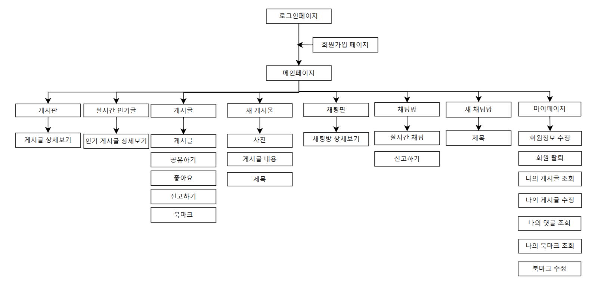
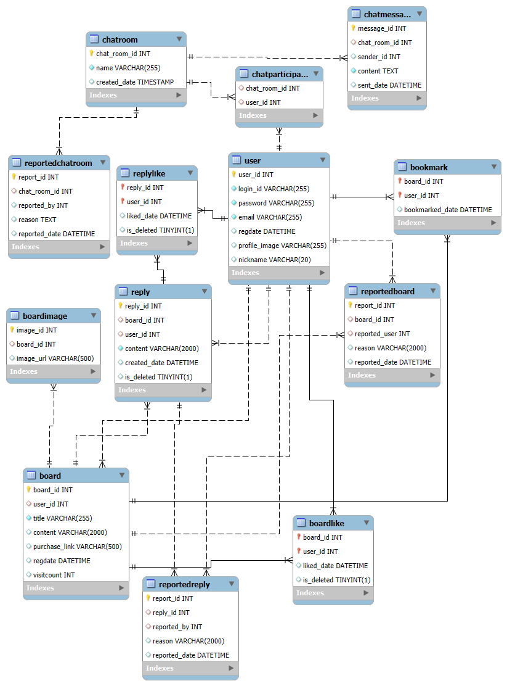

# 기획

 학원에서 팀프로젝트를 시작했다. 팀원은 나 포함 4명이었다. 주제는 한 이틀정도 회의하다가 처음엔 여행관련 웹 앱을 만들려고 하다가 지역별 카테고리가 너무 많은것 같아서 포기하고 자신의 옷 스타일을 찍어서 올릴 수 있는 sns같은 웹 앱을 만들기로 했다.

기획하는 과정에서 나는 DB 스키마 설계를 맡았다. 우선, 기획할 때 만든 메뉴 구조도는 다음과 같다.

## 게시물 관련 테이블

먼저 내가 설계한 테이블은 총 13개이다. 게시판부터 살펴보면, 기본적인 CRUD 기능, 사진 업로드 기능, 좋아요, 신고, 북마크기능이 있다. 이 점을 기반으로 게시판 관련 DB를 만들어보면

* 게시물
* 게시물에 업로드 되는 이미지
* 게시물에 눌러진 좋아요
* 북마크
* 신고된 게시물

## 댓글 관련 테이블

댓글에는 신고기능, 좋아요 기능이 있다.

* 댓글
* 댓글에 눌려진 좋아요
* 신고된 댓글

## 채팅방 관련 테이블

채팅은 여러명이 들어올 수 있는 채팅방을 여러개 만들 수 있도록 만들 예정이다. 채팅은 웹소켓을 이용한 실시간 채팅이고 채팅은 개별 채팅이 아닌 채팅방을 신고하는 시스템을 만들 예정이다.

* 채팅방
* 채팅 메시지
* 채팅 참가자
* 신고된 채팅방

## 사용자 테이블

그리고 마지막으로 빠질 수 없는 사용자 테이블을 만들었다.

## ERD

이렇게 해서 만들어진 ERD는 다음과 같다.

