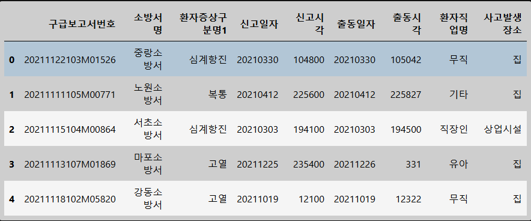
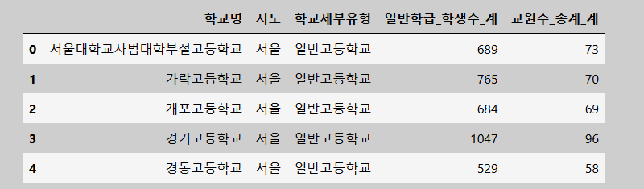
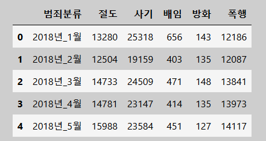

# 1유형

## 1-1

```python
### 각 구급 보고서 별 출동시각과 신고시각의 차이를 ‘소요시간’ 컬럼을 만들고 
### 초(sec)단위로 구하고 
### 소방서명 별 소요시간의 평균을 오름차순으로 정렬 했을때 
### 3번째로 작은 소요시간의 값과 소방서명을 출력하라
import pandas as pd
df = pd.read_csv('https://raw.githubusercontent.com/Datamanim/datarepo/main/krdatacertificate/e6_p1_1.csv')
df.head(5)
```




```python
df["소요시각"] = (
	pd.to_datetime(
    	df["출동일자"].astype("str") + df["출동시각"].astype("str").str.zfill(6)
    )
	-
    pd.to_datetime(
    	df["신고일자"].astype("str") + df["신고시각"].astype("str").str.zfill(6)	
    )
).dt.total_seconds()

result = df.groupby(["소방서명"])["소요시각"].mean().sort_values().reset_index().iloc[2].values
```


## 1-2

```python
# 학교 세부유형이 일반중학교인 학교들 중 
# 일반중학교 숫자가 2번째로 많은 시도의 일반중학교 데이터만 필터하여
# 해당 시도의 교원 한명 당 맡은 학생수가 가장 많은 학교를 찾아서
# 해당 학교의 교원수를 출력하라
import pandas as pd
df = pd.read_csv('https://raw.githubusercontent.com/Datamanim/datarepo/main/krdatacertificate/e6_p1_2.csv')
df.head(5)
```



```python
# 일반 중학교 숫자가 두번째로 많은 시도 구함
city = df[df["학교세부유형"] == "일반중학교"]["시도"].value_counts().index[1]

# 일반중학교이면서 서울(바로 위에서 구한 city)인 학교 데이터
filtered_df = df[(df["학교세부유형"] == "일반중학교") & (df["시도"] == city)].reset_index(drop = True)

# 교원 한명당 맡아야 하는 학생수(파생변수) 생성
filtered_df.loc[:, "ratio"] = (filtered_df["일반학급_학생수_계"]) / (filtered_df["교원수_총계_계"])

# 파생변수 기준으로 정렬 & 파생변수에 있는 null값 제거
filtered_df = filtered_df.sort_values("ratio").dropna()

# 교원 한명당 학생수 가장 많은 학교의 교원수
result = filtered_df["교원수_총계_계"].values[-1]
```


## 1-3

```python
#5대 범죄(절도, 사기, 배임, 방화, 폭행)의 월별 총 발생건수를 총범죄수라고 표현하자. 
#18,19년의 각각 분기별 총범죄수의 월평균 값을 구했을때 최대값을 가지는 년도와 분기를 구하고 
#해당 분기의 최댓값의 사기가 발생한 월의 사기 발생건수를 출력하라
#(1분기:1,2,3월 / 2분기 : 4,5,6월 / 3분기 7,8,9월 / 4분기 10,11,12월 , 1분기 월평균 : 1,2,3월의 총범죄수 평균)

import pandas as pd
df = pd.read_csv('https://raw.githubusercontent.com/Datamanim/datarepo/main/krdatacertificate/e6_p1_3.csv')
df.head(5)
```



# 3유형

## 3-2-a

**age와 Cholesterol을 가지고 weight를 예측하는 선형 회귀 모델을 만들려고한다. age의 회귀 계수를 구하여라**

```python
import pandas as pd 
df= pd.read_csv('https://raw.githubusercontent.com/Datamanim/datarepo/main/adp/28/p7.csv')
df.head()

# age와 Cholesterol을 가지고 weight를 예측하는 선형 회귀 모델을 만들려고한다. 
# age의 회귀 계수를 구하여라
from sklearn.model_selection import train_test_split
from sklearn.linear_model import LinearRegression

x = df.drop(columns = ["weight"])
y = df["weight"]

x_train, x_test, y_train, y_test = train_test_split(x, y, test_size = 0.2)

lr = LinearRegression()
result = lr.fit(x_train, y_train)

age_coefficient = lr.coef_[0]
print("age 회귀계수 : ", age_coefficient)
```

이렇게 풀어도 상관없지만 다음문제 pvalue를 구하라면 statsmodels를 이용해야 한다.
